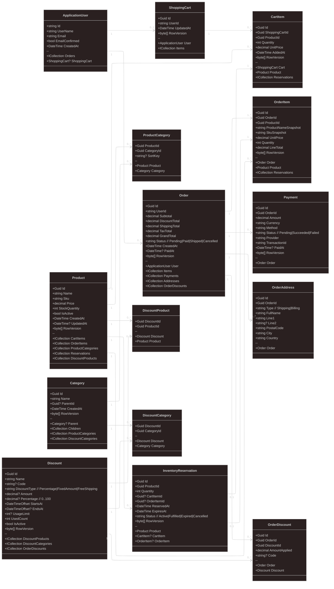

```mermaid
---
config:
  layout: elk
  look: classic
  theme: neo-dark
---
classDiagram
direction LR
    class ApplicationUser {
	    +string Id
	    +string UserName
	    +string Email
	    +bool EmailConfirmed
	    +DateTime CreatedAt
	    --
	    +ICollection Orders
	    +ShoppingCart? ShoppingCart
    }
    class ShoppingCart {
	    +Guid Id
	    +string UserId
	    +DateTime UpdatedAt
	    +byte[] RowVersion
	    --
	    +ApplicationUser User
	    +ICollection Items
    }
    class CartItem {
	    +Guid Id
	    +Guid ShoppingCartId
	    +Guid ProductId
	    +int Quantity
	    +decimal UnitPrice
	    +DateTime AddedAt
	    +byte[] RowVersion
	    --
	    +ShoppingCart Cart
	    +Product Product
	    +ICollection Reservations
    }
    class Product {
	    +Guid Id
	    +string Name
	    +string Sku
	    +decimal Price
	    +int StockQuantity
	    +bool IsActive
	    +DateTime CreatedAt
	    +DateTime? UpdatedAt
	    +byte[] RowVersion
	    --
	    +ICollection CartItems
	    +ICollection OrderItems
	    +ICollection ProductCategories
	    +ICollection Reservations
	    +ICollection DiscountProducts
    }
    class Category {
	    +Guid Id
	    +string Name
	    +Guid? ParentId
	    +DateTime CreatedAt
	    +byte[] RowVersion
	    --
	    +Category? Parent
	    +ICollection Children
	    +ICollection ProductCategories
	    +ICollection DiscountCategories
    }
    class ProductCategory {
	    +Guid ProductId
	    +Guid CategoryId
	    +string? SortKey
	    --
	    +Product Product
	    +Category Category
    }
    class Order {
	    +Guid Id
	    +string UserId
	    +decimal Subtotal
	    +decimal DiscountTotal
	    +decimal ShippingTotal
	    +decimal TaxTotal
	    +decimal GrandTotal
	    +string Status  // Pending|Paid|Shipped|Cancelled
	    +DateTime CreatedAt
	    +DateTime? PaidAt
	    +byte[] RowVersion
	    --
	    +ApplicationUser User
	    +ICollection Items
	    +ICollection Payments
	    +ICollection Addresses
	    +ICollection OrderDiscounts
    }
    class OrderItem {
	    +Guid Id
	    +Guid OrderId
	    +Guid ProductId
	    +string ProductNameSnapshot
	    +string SkuSnapshot
	    +decimal UnitPrice
	    +int Quantity
	    +decimal LineTotal
	    +byte[] RowVersion
	    --
	    +Order Order
	    +Product Product
	    +ICollection Reservations
    }
    class Payment {
	    +Guid Id
	    +Guid OrderId
	    +decimal Amount
	    +string Currency
	    +string Method
	    +string Status   // Pending|Succeeded|Failed
	    +string Provider
	    +string TransactionId
	    +DateTime? PaidAt
	    +byte[] RowVersion
	    --
	    +Order Order
    }
    class OrderAddress {
	    +Guid Id
	    +Guid OrderId
	    +string Type    // Shipping|Billing
	    +string FullName
	    +string Line1
	    +string? Line2
	    +string PostalCode
	    +string City
	    +string Country
	    --
	    +Order Order
    }
    class Discount {
	    +Guid Id
	    +string Name
	    +string? Code
	    +string DiscountType  // Percentage|FixedAmount|FreeShipping
	    +decimal? Amount
	    +decimal? Percentage  // 0..100
	    +DateTimeOffset StartsAt
	    +DateTimeOffset? EndsAt
	    +int? UsageLimit
	    +int UsedCount
	    +bool IsActive
	    +byte[] RowVersion
	    --
	    +ICollection DiscountProducts
	    +ICollection DiscountCategories
	    +ICollection OrderDiscounts
    }
    class DiscountProduct {
	    +Guid DiscountId
	    +Guid ProductId
	    --
	    +Discount Discount
	    +Product Product
    }
    class DiscountCategory {
	    +Guid DiscountId
	    +Guid CategoryId
	    --
	    +Discount Discount
	    +Category Category
    }
    class OrderDiscount {
	    +Guid Id
	    +Guid OrderId
	    +Guid DiscountId
	    +decimal AmountApplied
	    +string? Code
	    --
	    +Order Order
	    +Discount Discount
    }
    class InventoryReservation {
	    +Guid Id
	    +Guid ProductId
	    +int Quantity
	    +Guid? CartItemId
	    +Guid? OrderItemId
	    +DateTime ReservedAt
	    +DateTime ExpiresAt
	    +string Status   // Active|Fulfilled|Expired|Cancelled
	    +byte[] RowVersion
	    --
	    +Product Product
	    +CartItem? CartItem
	    +OrderItem? OrderItem
    }

    ApplicationUser "1" --> "0..1" ShoppingCart
    ApplicationUser "1" --> "0..*" Order
    ShoppingCart "1" --> "0..*" CartItem
    Product "1" --> "0..*" CartItem
    Order "1" --> "1..*" OrderItem
    Product "1" --> "0..*" OrderItem
    Order "1" --> "0..*" Payment
    Order "1" --> "1..*" OrderAddress
    Product "1" --> "0..*" ProductCategory
    Category "1" --> "0..*" ProductCategory
    Discount "1" --> "0..*" DiscountProduct
    Product "1" --> "0..*" DiscountProduct
    Discount "1" --> "0..*" DiscountCategory
    Category "1" --> "0..*" DiscountCategory
    Order "1" --> "0..*" OrderDiscount
    Discount "1" --> "0..*" OrderDiscount
    Product "1" --> "0..*" InventoryReservation
    InventoryReservation "0..1" --> "1" CartItem
    InventoryReservation "0..1" --> "1" OrderItem
```